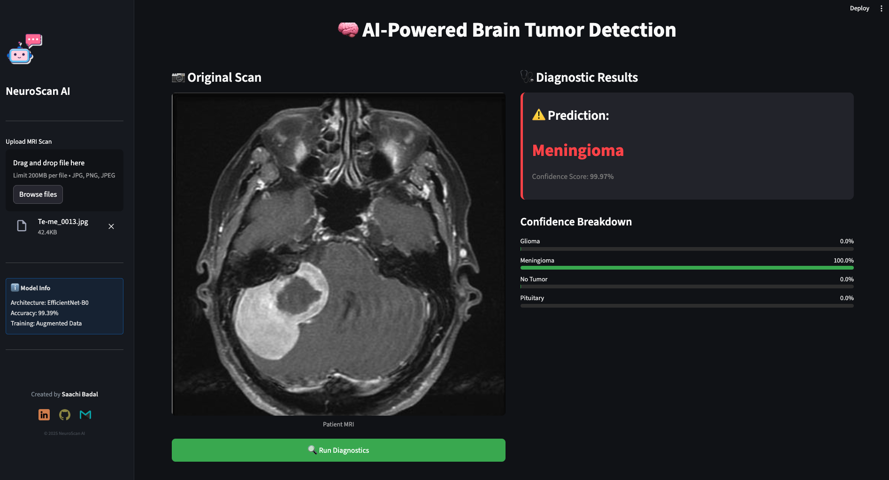
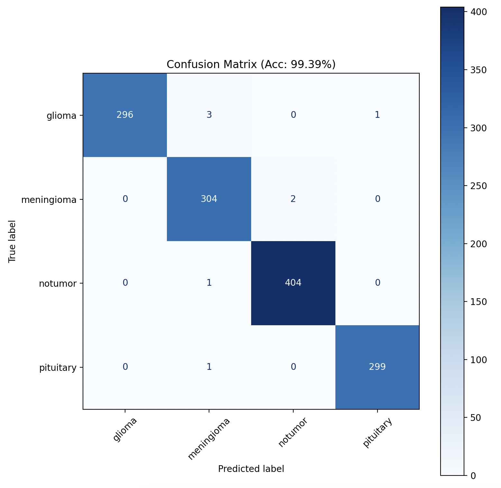
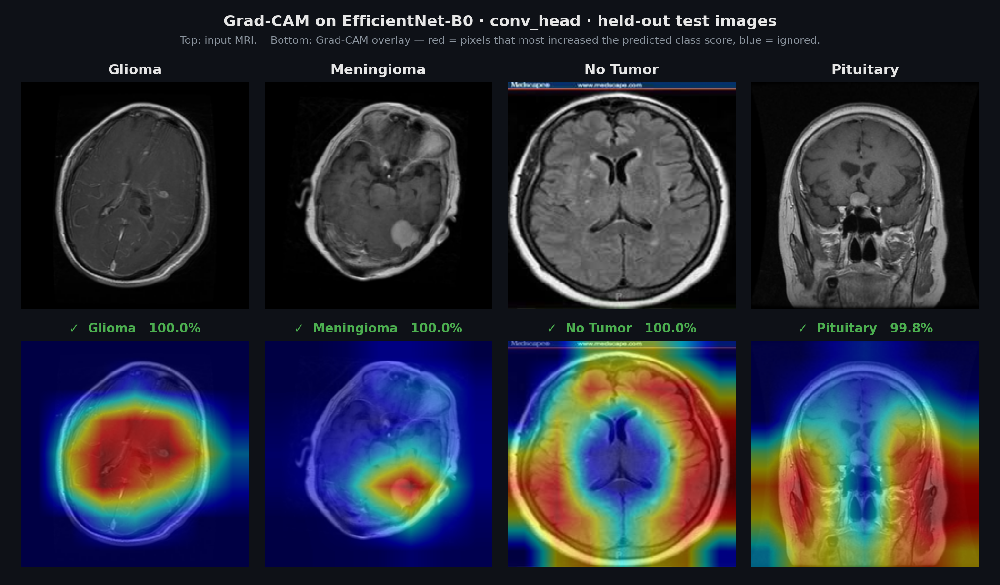
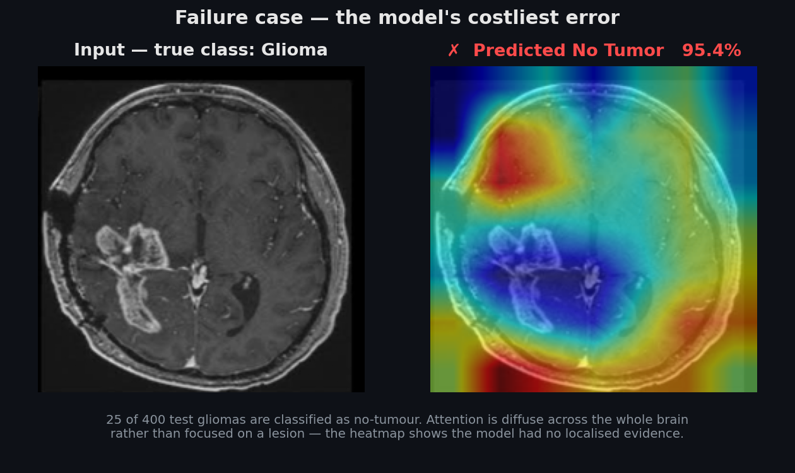

# 🧠 Deep Learning Brain Tumor MRI Classifier


Four-class brain-tumour MRI classifier built on EfficientNet-B0, with Grad-CAM
explainability and a Streamlit diagnostic interface. Every number in this README is
measured on a held-out test set and reproducible with one command.



---

## 📊 Results at a glance

Measured on **1,600 held-out images** (400 per class) never seen during training:

| | | | |
|---|---|---|---|
| **Test accuracy** | **95.19%** | **ROC-AUC** (OvR macro) | **0.9950** |
| **Macro F1** | **0.9509** | Test loss | 0.4739 |
| **Specificity** (tumour vs. healthy) | **100.00%** | Sensitivity | 97.83% |
| Cohen's κ | 0.9358 | Matthews corr. | 0.9374 |
| Inference | 14.96 ms/image | Model size | 4.01M params / 16.35 MB |

Two results worth highlighting:

- **Zero false positives.** Across 400 healthy scans, the model never flagged one as a tumour.
- **Augmented fine-tuning cut test errors by 31%** (111 → 77 misclassifications) and
  eliminated all three remaining false positives.

Reproduce everything with `python src/report_metrics.py` → writes
[`reports/metrics.json`](reports/metrics.json) and [`reports/metrics.md`](reports/metrics.md).

---

## 🎯 What it does

- **Four-class classification** — glioma, meningioma, pituitary tumour, no tumour
- **Transfer learning** — ImageNet-pretrained EfficientNet-B0, fine-tuned in two stages
- **Grad-CAM explainability** — heatmaps showing which pixels drove each prediction
- **Streamlit interface** — upload a scan, get a class, confidence breakdown, and heatmap
- **Reproducible evaluation** — one script regenerates every metric and figure in this README

---

## 🚀 Quickstart

```bash
git clone https://github.com/Saachi26/Deep-Learning-Brain-Tumor-MRI-Classifier-with-GradCAM.git
cd Deep-Learning-Brain-Tumor-MRI-Classifier-with-GradCAM
python -m venv venv && source venv/bin/activate   # Windows: venv\Scripts\activate
pip install -r requirements.txt
```

Then add the [dataset](#dataset) and [trained weights](#trained-weights), and run:

```bash
streamlit run src/app.py
```

---

<a id="dataset"></a>

## 📥 Dataset

Not included in this repo (large, license-restricted). Download the
[**Brain Tumor MRI Dataset**](https://www.kaggle.com/datasets/masoudnickparvar/brain-tumor-mri-dataset)
by Nickparvar and unzip into `data/` so the structure matches exactly (folder names are
case-sensitive):

```
data/
├── Training/{glioma,meningioma,notumor,pituitary}/
└── Testing/{glioma,meningioma,notumor,pituitary}/
```

| Split | glioma | meningioma | notumor | pituitary | Total |
|---|---|---|---|---|---|
| Training pool | 1,400 | 1,400 | 1,400 | 1,400 | 5,600 |
| Test (held out) | 400 | 400 | 400 | 400 | 1,600 |
| | | | | | **7,200** |

The training pool is split 80/20 at train time → 4,480 train / 1,120 validation.

---

<a id="trained-weights"></a>

## ⚠️ Trained weights

The app and evaluation scripts load `models/brain_tumor_efficientnet_augmented.pth`,
which is **not committed** (too large for git). Either train it yourself (below) or drop
your own checkpoint in `models/` under that exact filename. Without it,
`streamlit run src/app.py` will not start.

---

## 💻 Usage

### Run the app

```bash
streamlit run src/app.py
```

Upload an MRI scan to get a predicted class, a per-class confidence breakdown, and a
Grad-CAM heatmap.

### Train

The scripts form a chain — run in order:

```bash
python src/train.py              # Stage 1: ImageNet-pretrained B0 → brain_tumor_efficientnet.pth
python src/augmentedFinetune.py  # Stage 2: augmented fine-tune → ..._augmented.pth  (app uses this)
```

> `src/finetune.py` is an earlier, simpler fine-tuning experiment. It is **not** part of
> the final pipeline.

### Evaluate

```bash
python src/evaluate.py        # classification report + confusion matrix for the final model
python src/report_metrics.py  # full report: every checkpoint, all metrics → reports/
```

Regenerate the Grad-CAM figures used below:

```bash
python src/make_heatmap_figure.py   # → assets/HeatMap.png, assets/HeatMapFailure.png
```

---

## 📈 Model performance

### Headline — `brain_tumor_efficientnet_augmented.pth`

| Metric | Value |
|---|---|
| **Test accuracy** | **95.19%** (1,523 / 1,600) |
| Balanced accuracy | 95.19% |
| Top-2 accuracy | 96.44% |
| Test loss (cross-entropy) | 0.4739 |
| **Macro F1** | **0.9509** |
| Weighted F1 | 0.9509 |
| Macro precision / recall | 0.9551 / 0.9519 |
| **ROC-AUC** (one-vs-rest, macro) | **0.9950** |
| Cohen's κ | 0.9358 |
| Matthews correlation coef. | 0.9374 |
| Inference latency | 14.96 ms/image (66.9 img/s, Apple Silicon MPS) |
| Model size | 4,012,672 params / 16.35 MB |

### Per class

| Class | Precision | Recall | F1 | Support |
|---|---|---|---|---|
| glioma | 0.9970 | 0.8300 | 0.9059 | 400 |
| meningioma | 0.8991 | 0.9800 | 0.9378 | 400 |
| notumor | 0.9390 | **1.0000** | 0.9685 | 400 |
| pituitary | 0.9852 | 0.9975 | 0.9913 | 400 |



*Confusion matrix on the 1,600-image held-out test set. Regenerate with
`python src/report_metrics.py`.*

Glioma is the weakest class at 83.0% recall — 43 gliomas are read as meningioma and 25 as
no-tumour. Every other class scores ≥98% recall.

### Tumour vs. no tumour

Collapsing the three tumour classes into one "tumour present" label:

| Metric | Value |
|---|---|
| Sensitivity | 97.83% |
| **Specificity** | **100.00%** |
| False positives | **0** |
| False negatives | 26 / 1,200 |

### Ablation — what augmented fine-tuning bought

| Metric | Stage 1 (`train.py`) | Stage 2 (`augmentedFinetune.py`) | Δ |
|---|---|---|---|
| Test accuracy | 93.06% | **95.19%** | **+2.13 pts** |
| Macro F1 | 0.9296 | **0.9509** | +0.0213 |
| ROC-AUC | 0.9923 | **0.9950** | +0.0027 |
| Misclassified | 111 | **77** | **−31% errors** |
| glioma recall | 0.7675 | **0.8300** | +0.0625 |
| False positives | 3 | **0** | −3 |

### Training configuration

| Item | Value |
|---|---|
| Architecture | EfficientNet-B0 (`timm`), ImageNet-pretrained |
| Input | 224 × 224 RGB, ImageNet mean/std normalisation |
| Loss / Optimizer | Cross-entropy / AdamW |
| Stage 1 | LR 1e-3, 5 epochs, batch 32 |
| Stage 2 | LR 1e-4, weight decay 1e-4, 10 epochs, batch 32 |
| Stage 2 augmentation | HFlip, Rotation(15°), Affine translate 0.1, ColorJitter(0.2, 0.2) |
| Hardware | Apple Silicon GPU via PyTorch MPS |

---

## 🔍 Explainability with Grad-CAM

Grad-CAM is computed on `model.conv_head`, EfficientNet-B0's final convolutional layer,
against the predicted class. The resulting activation map is upsampled and overlaid on
the original scan:

- **Red** — high attention, pixels that most increased the predicted class score
- **Blue** — low attention, background or tissue the model ignored



*One correctly-classified held-out test image per class. Regenerate with
`python src/make_heatmap_figure.py`.*

This is a debugging tool as much as a presentation one: if attention sits off the tumour
while the model still predicts correctly, the prediction is being driven by something
other than the lesion — and that is visible above. The maps are informative but not
crisply lesion-localised: attention frequently sits on the skull rim and surrounding
background rather than tightly on the mass. Two structural reasons, both real: the map is
7x7 upsampled 32x to 224x224, so its finest resolution is a 32-pixel block; and
`show_cam_on_image` min-max normalises every map, so a hotspot always exists regardless of
how weak the underlying evidence was.

Running the same thing on an error is more useful than running it on a success:



*A glioma confidently classified as no-tumour. Attention is diffuse and largely outside
the brain — the model had no localised evidence and returned 95.4% confidence anyway.*

---

## ⚖️ Limitations

Stated plainly, because a number without its caveats is not a result.

- **Not a medical device.** A research and portfolio project. Nothing here is validated
  for clinical use.
- **No patient-level split.** The Kaggle dataset ships no patient IDs, so slices cannot be
  grouped by patient. Its Figshare component contains 3,064 slices from only 233 patients,
  meaning many near-identical slices from the same patient exist in the data — and a random
  split can place them on both sides of the train/test boundary. Accuracy measured this way
  is optimistic relative to a patient-grouped split. See Zech et al. (2018) on this failure
  mode in medical imaging.
- **The model is confidently wrong.** Mean confidence is 99.78% on correct predictions but
  still **88.08% on incorrect ones**. It is not calibrated and has no abstain mechanism, so
  errors do not announce themselves.
- **Glioma is the clinically important weak spot.** 25 gliomas were classified as no-tumour
  — a false negative is the costliest error class here.
- **Single run, no seeding.** Training scripts do not set a random seed, so the train/val
  split and augmentation differ between runs. Results are from one architecture and one run,
  not a seed-averaged estimate with confidence intervals.
- **No external validation.** Everything is measured within a single dataset. The commonly
  used "second" brain-tumour dataset (SARTAJ) shares source images with this one, so it
  cannot serve as an independent test set.
- **Robustness untested.** No evaluation under scanner or acquisition shift — noise, blur,
  contrast or intensity changes of the kind that separate a benchmark from a clinic.

> **On the earlier 99.39% figure.** Previous versions of this project reported 99.39%,
> measured on the *original* 7,023-image release of the Kaggle dataset, which its author has
> since replaced. That number is not reproducible against the data this repo now uses.
> **95.19% is the reproducible result** on the current 7,200-image version.

---

## 📂 Project structure

```
├── src/
│   ├── app.py                 # Streamlit interface
│   ├── train.py               # Stage 1: initial training
│   ├── augmentedFinetune.py   # Stage 2: augmented fine-tuning (final model)
│   ├── finetune.py            # earlier experiment, not in the final pipeline
│   ├── evaluate.py            # classification report + confusion matrix
│   ├── predict.py             # single-image prediction + Grad-CAM
│   ├── report_metrics.py      # full reproducible metrics report
│   └── make_heatmap_figure.py # regenerates the Grad-CAM figures in assets/
├── reports/                   # generated: metrics.json, metrics.md, confusion matrices
├── assets/                    # figures used in this README
├── data/                      # dataset (not committed)
├── models/                    # trained weights (not committed)
└── requirements.txt
```

---

## 🛠️ Tech stack

**Deep learning** PyTorch · timm · EfficientNet-B0
**Vision** Torchvision · OpenCV · Pillow
**Explainability** pytorch-grad-cam
**Metrics** scikit-learn · NumPy · Matplotlib
**Interface** Streamlit

---

## 📜 License

MIT — see [LICENSE](LICENSE).
